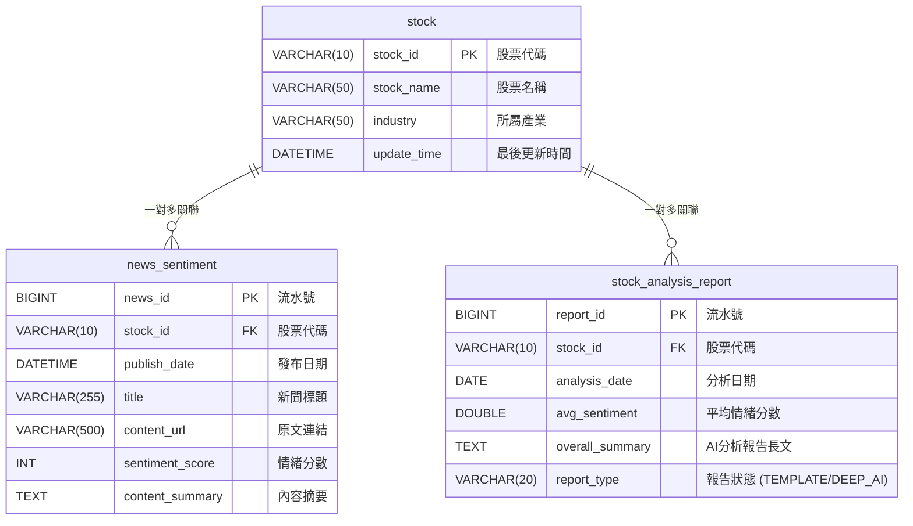

```mermaid
erDiagram
    %% 這是實體層級的 Schema 圖，包含精確的建表規格與中文說明
    stock ||--o{ news_sentiment : "一對多關聯"
    stock ||--o{ stock_analysis_report : "一對多關聯"

    stock {
        VARCHAR(10) stock_id PK "股票代碼"
        VARCHAR(50) stock_name "股票名稱"
        VARCHAR(50) industry "所屬產業"
        DATETIME update_time "最後更新時間"
    }

    news_sentiment {
        BIGINT news_id PK "流水號"
        VARCHAR(10) stock_id FK "股票代碼"
        DATETIME publish_date "發布日期"
        VARCHAR(255) title "新聞標題"
        VARCHAR(500) content_url "原文連結"
        INT sentiment_score "情緒分數"
        TEXT content_summary "內容摘要"
    }

    stock_analysis_report {
        BIGINT report_id PK "流水號"
        VARCHAR(10) stock_id FK "股票代碼"
        DATE analysis_date "分析日期"
        DOUBLE avg_sentiment "平均情緒分數"
        TEXT overall_summary "AI分析報告長文"
        VARCHAR(20) report_type "報告狀態 (TEMPLATE/DEEP_AI)"
    }
```
