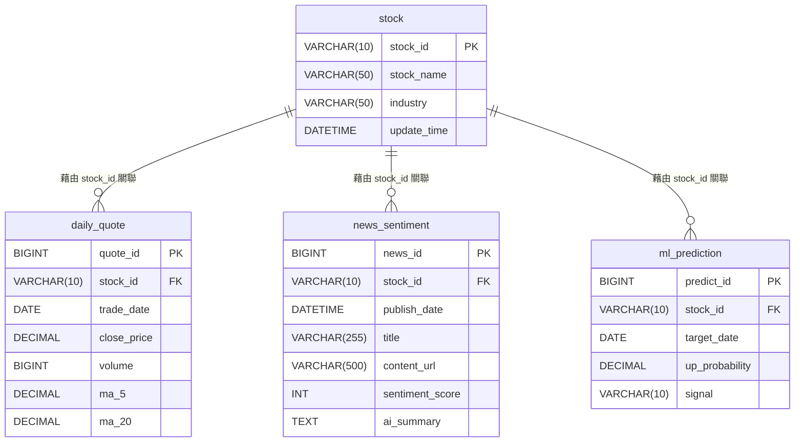

```mermaid
erDiagram
    %% 這是實體層級的 Schema 圖，包含精確的建表規格
    stock ||--o{ daily_quote : "藉由 stock_id 關聯"
    stock ||--o{ news_sentiment : "藉由 stock_id 關聯"
    stock ||--o{ ml_prediction : "藉由 stock_id 關聯"

    stock {
        VARCHAR(10) stock_id PK
        VARCHAR(50) stock_name
        VARCHAR(50) industry
        DATETIME update_time
    }

    daily_quote {
        BIGINT quote_id PK
        VARCHAR(10) stock_id FK
        DATE trade_date
        DECIMAL close_price
        BIGINT volume
        DECIMAL ma_5
        DECIMAL ma_20
    }

    news_sentiment {
        BIGINT news_id PK
        VARCHAR(10) stock_id FK
        DATETIME publish_date
        VARCHAR(255) title
        VARCHAR(500) content_url
        INT sentiment_score
        TEXT ai_summary
    }

    ml_prediction {
        BIGINT predict_id PK
        VARCHAR(10) stock_id FK
        DATE target_date
        DECIMAL up_probability
        VARCHAR(10) signal
    }
```