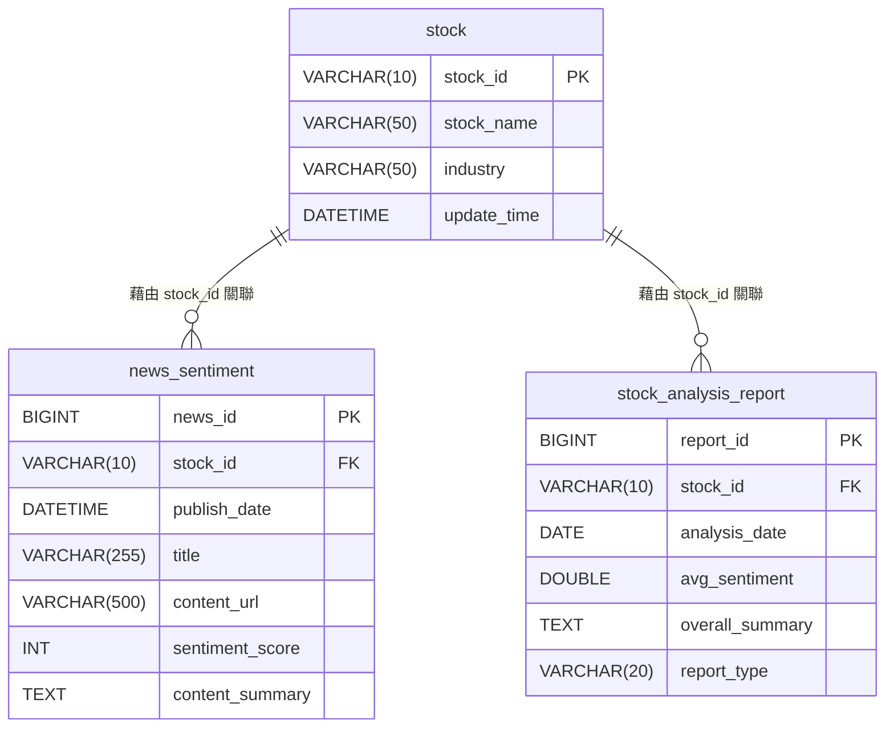

```mermaid
erDiagram
    %% 這是實體層級的 Schema 圖，包含精確的建表規格
    stock ||--o{ news_sentiment : "藉由 stock_id 關聯"
    stock ||--o{ stock_analysis_report : "藉由 stock_id 關聯"

    stock {
        VARCHAR(10) stock_id PK
        VARCHAR(50) stock_name
        VARCHAR(50) industry
        DATETIME update_time
    }

    news_sentiment {
        BIGINT news_id PK
        VARCHAR(10) stock_id FK
        DATETIME publish_date
        VARCHAR(255) title
        VARCHAR(500) content_url
        INT sentiment_score
        TEXT content_summary
    }

    stock_analysis_report {
        BIGINT report_id PK
        VARCHAR(10) stock_id FK
        DATE analysis_date
        DOUBLE avg_sentiment
        TEXT overall_summary
        VARCHAR(20) report_type
    }
```
